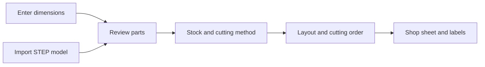

# Cut-list workflow recommendation

Research and code review: 13 September 2026. This is a proposal for the next restructure; the sidebar and account Settings page are implemented separately.

Build one workflow around the pieces the user needs. Manual dimensions and a 3D assembly should produce the same editable parts list. Then plan how those parts will be obtained from available material, using the user's cutting equipment.



## What the research establishes

**A parts list and a cutting plan answer different questions.** A list records the required components and their dimensions; the plan assigns material and operations. Peter Korn's woodworking process starts with dimensions that include tenons, lays parts out with grain in mind, and prepares rectangular blanks before shaping curved parts. Milling also introduces a tradeoff between handling time and material yield. These are manufacturing decisions beyond fitting rectangles. [Fine Woodworking: Flat, Straight and Square](https://www.finewoodworking.com/1993/10/01/flat-straight-and-square).

**Dimensions need an explicit meaning.** Finished dimensions, the substrate underneath edge banding, and an oversized blank can differ. MaxCut records banding separately for each edge; its expansion feature distinguishes rough and final panel sizes. Kerf, edge trimming, and milling allowance should therefore have separate fields and explanations. [MaxCut: Edging on Panels](https://knowledge.maxcutsoftware.com/help/edging-on-panels), [MaxCut: Cutting Optimization](https://maxcutsoftware.com/features/cutting-optimization/).

**CAD geometry requires review.** OpenCutList documents the importance of part axes, material, grain direction, and all three dimensions. Its bounding-box approach treats even irregular components as rectangular blanks. For Kerf, a selected face and bounding dimensions should be a reviewed starting point; they cannot determine every manufacturing operation. [OpenCutList: Components](https://docs.opencutlist.org/getting-started/components).

**Material and orientation constrain placement.** OpenCutList groups sheet parts by material and thickness, restricts rotation for grained material, accepts offcuts, and accounts for blade thickness and perimeter trimming. The user's available quantities also matter: a plan should distinguish stock on hand from material to buy. [OpenCutList: Sheet Goods](https://docs.opencutlist.org/features/parts/parts-list/cutting-diagrams/sheet-goods).

**The cutting method changes which layouts are usable.** MaxCut describes guillotine cuts as edge-to-edge cuts through the current sheet or remaining piece, with options for the first direction and number of stages. Esko explicitly distinguishes unrestricted nesting from layouts that its guillotine equipment can execute. Kerf should preserve cut dependencies while planning saw operations, rather than trying to infer an order from an arbitrary dense layout afterward. Geometric feasibility alone does not establish machine capacity or workholding suitability. [MaxCut: Tailored Optimization](https://maxcutsoftware.com/features/cutting-optimization/tailored-optimization/), [Esko: Nesting Options](https://docs.esko.com/docs/en-us/icutlayoutplus/14/userguide/en-us/common/icp/concept/co_icp_nestingoptions.html).

**Grain direction and grain matching are separate.** Preventing rotation preserves direction; keeping adjacent drawer fronts in a particular sequence preserves continuity. MaxCut supports explicit matched groups. Kerf should model these separately, starting with direction. [MaxCut: How to Match Grain](https://knowledge.maxcutsoftware.com/help/how-to-match-grain-in-maxcut).

**Some dimensions are confirmed during the build.** Matthew Kenney describes using a cut list for planning and rough preparation while fitting dependent pieces to the actual assembly. Support a “confirm after assembly” note and rough allowance instead of treating every design dimension as immediately ready for final cutting. [Fine Woodworking: Cutlists Are a Waste of Space](https://www.finewoodworking.com/2011/01/24/cutlists-are-a-waste-of-space).

## What Kerf already has

This assessment comes from the local source, not vendor documentation.

| Area | Current behavior | Consequence for the restructure |
| --- | --- | --- |
| Entry routes | `/cut-list` is a local quick optimizer; `/dashboard` manages projects; `/projects/[id]/step` imports CAD. | People encounter separate entry and saving experiences for the same task. |
| Parts | Labels, dimensions, thickness, quantity, material, groups, and STEP references exist. | Preserve these capabilities and converge on one editor. |
| CAD import | Bodies can be selected, faces confirmed, and dimensions taken from a projection. | Keep review and source links; make importing an action within Parts. |
| Layout | Several rectangle packers, kerf, part padding, sheet edge padding, material/thickness checks, and manual placements exist. | Reuse geometry and interaction work behind a clearer planning interface. |
| Optimization | `compareSolutions` prioritizes unplaced parts, sheet count, then waste; the candidates include MaxRects. | The winner does not necessarily have a valid sequence of saw cuts. |
| Manufacturing constraints | `Cut` has no grain, per-edge banding, or finished/blank dimension distinction. Unspecified thickness can match any stock. | Allow incomplete drafts, but require those decisions before calling a plan ready to cut. |
| Output | CSV, SVG, PDF, STEP-derived DXF and project bundles already exist. | Keep exports, but generate them from the same saved plan revision. |
| Structure | The project page is 2,631 lines; quick optimizer 778; STEP page 906. | Extract feature modules and separate planning, persistence, exports, and presentation. |

The existing `OptimizationResult` contains sheets and unplaced parts. It has no ordered operation model or cut tree. Even where a packing routine uses guillotine splits internally, the returned result does not retain the operation history needed for a reliable cutting sequence.

## Recommended experience

Use **Cut lists** as the eventual main destination. Each saved cut list has a name and one workspace. Projects can later group several lists or assemblies, but should not be a prerequisite for typing the first part. Preserve guest drafts if we retain public access; authenticated lists use PostgreSQL. Both use the same editor.

Inside that workspace, use four compact tabs with completion indicators. Users can revisit any tab; this should not be a rigid wizard.

| Tab | Main content | Result |
| --- | --- | --- |
| **Parts** | A compact table; “Add part” and “Import 3D model” actions. CAD review appears alongside the table with linked selection. | One reviewed parts list, regardless of source. |
| **Stock & method** | Sheets/offcuts grouped by material and thickness; quantity, usable dimensions, grain, edge trims, cutting method and measured kerf. | Explicit material and manufacturing constraints. |
| **Cut plan** | Sheet diagram with a linked, numbered operation list; shortages and unresolved constraints visible. | Placement plus an executable geometric sequence for the selected method. |
| **Shop sheet** | Print/PDF, CSV, part labels, and appropriate CAD exports. | A stable revision that can be followed at the bench. |

Parts table defaults: **ID, name, quantity, length, width, thickness, material, grain**. Use an expandable details area for rough allowances, edge banding, joinery notes, assembly group, source model and “fit later.” Bulk editing should handle material, thickness and grain. Matching sizes alone must not merge parts with different material, edging, grain or machining requirements.

For STEP import, review included bodies, duplicates/instances, selected face, thickness, units and grain. Separate hardware and unsupported geometry from cuttable parts. Preserve each instance's source identity; a user can add manual parts to the same list afterward. Do not claim that an arbitrary mesh can automatically be decomposed into manufacturable components; the initial contract is the existing STEP solids workflow.

Keep **finished size**, **blank size**, **kerf**, **sheet trim**, and **tool clearance** distinct. For example, under a finished-size convention, a 600 mm panel with 1 mm banding on each end starts with a 598 mm substrate. A separately chosen 2 mm trimming allowance at each end would require a 602 mm rough blank. Show the derivation; never deduct banding twice if CAD already models the substrate. These values illustrate the convention, not recommended default allowances.

Choose a cutting method before generating the plan:

- **Saw, rectangular sheet parts:** default to a sequence of edge-to-edge splits of the current workpiece. Record the parent sheet/strip, reference edge, finished target dimension, kerf side, children and dependencies. Consider machine capacity and sheet handling; a feasible rectangle split is only one part of a practical operation.
- **CNC:** retain the existing placement and DXF workflow. Model cutter clearance separately. A nested DXF is geometry for CAM; it is not a verified toolpath. Shaped nesting and toolpath sequencing require additional geometry and CAM work.
- **Solid timber:** add a distinct process later, with rough blanks, milling allowances, defects, grain selection, and final sizing. Linear stock cutting is also a separate planner. Do not present either as fully handled by the sheet optimizer.

In the first saw planner, prefer complete valid plans, then show the tradeoff between material consumption and cutting effort. Offer understandable choices such as “Fewer sheets” and “Simpler cutting,” with actual sheet count, operation count, direction changes, and reusable offcut dimensions. Do not promise a global optimum from the current heuristics.

Number **operations** separately from **parts**: one cut can separate a strip containing many parts. Selecting operation 3 should highlight its current workpiece and cut line, show what it produces, and identify any previous operations it depends on. Generate this from a cut tree. Arbitrary manual movement or rotation must revalidate the tree, grain and clearances, or visibly invalidate the plan.

A shop export should include units, revision, material, thickness, stock IDs, kerf/trims, part IDs and grain arrows, diagram, operation order, unplaced parts, and reusable offcuts. Label parts consistently across CAD, table, layout and print. Changes to parts, material or method should mark an existing plan out of date; a printed revision must remain identifiable.

## Recommended code structure

Keep Next.js route files small. Suggested boundaries:

```text
src/features/cut-lists/
  domain/          Part, StockItem, CutList, dimension rules, validation
  components/      PartsTable, PartDetails, StockEditor, CutListTabs
  persistence/     authenticated repository and optional guest draft adapter
src/features/cad-import/       STEP transport, source mapping, review UI
src/features/cut-planning/
  domain/          Placement, CutOperation, CutTree, PlanRevision
  solvers/         saw planner and existing nesting adapter
  components/      PlanViewer, OperationList, PlanIssues
src/features/shop-output/      shared export data, PDF, CSV, labels, DXF
```

Use **Part** for the component and **CutOperation** for an action. Rename the current `Cut` gradually through adapters. Use stable IDs for part definitions, instances, stock pieces, and revisions; labels remain editable display text. A first version can have one active plan per cut list without introducing a complex versioning system.

Normalize dimensions to one internal unit, preferably millimetres, and convert at input/output boundaries. Existing values and exports mix project-unit and inch assumptions, so audit those paths before changing storage. Retain adequate precision and explicit tolerances; display rounding must not change geometry.

The planner should be independent of React, authentication and the database. Run longer calculations in a worker with cancellation. Keep PostgreSQL under Coolify and server persistence outside components. These boundaries will also make the future open-source core easier to understand and test.

## Delivery order

1. **Unify Parts:** one list, two input methods, a compact editor and source links. Extract existing logic before changing the optimizer. This is the recommended next implementation slice.
2. **Add manufacturing constraints:** units, material/thickness validation, grain, explicit blank dimensions, stock/offcuts, method and trims.
3. **Build the saw planner:** retain cut trees and produce numbered operations; validate manual edits. Preserve the existing nesting/DXF path for CNC preparation.
4. **Unify shop output:** immutable exported revision, operation checklist, labels and reusable offcuts. Follow with costing, grain matching and solid-timber workflows as separate additions.

Meaningful acceptance cases: manual and CAD parts coexist; quantities preserve identity; grain prevents invalid rotation; material/thickness mismatches are explained; kerf/trim boundary cases fit correctly; metric and imperial inputs produce equivalent geometry; every saw operation splits an existing workpiece without crossing a retained part; edits invalidate affected plans; and exports reference the exact reviewed revision.

The navigation now contains Cut lists and Calculators, with Settings pinned at the bottom. Saved projects are part of the Cut lists library; the tool catalog and inventory have been removed.
